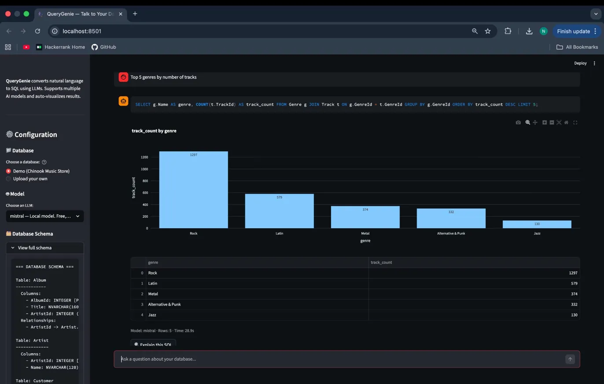
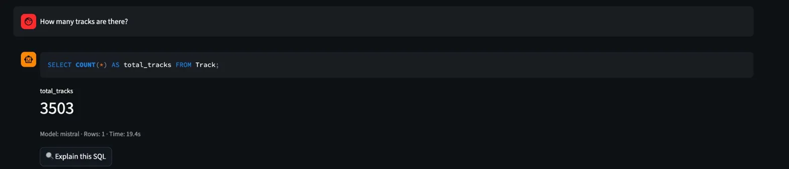
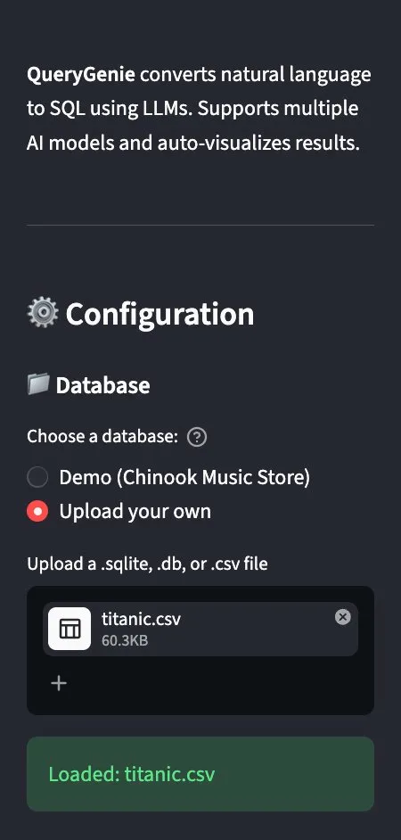
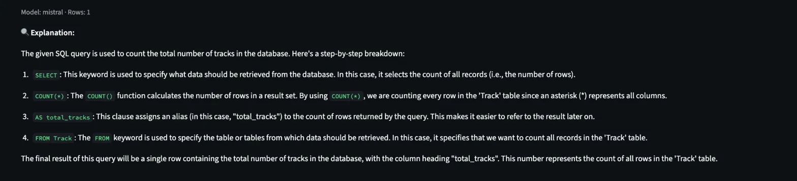

# 🧞 QueryGenie — Talk to Your Database

**Ask questions in plain English. Get SQL, results, and charts instantly.**

QueryGenie converts natural language questions into SQL queries using LLMs, executes them against your database, and auto-generates interactive visualizations — all in a clean chat interface.



> 🔗 **[Try the Live Demo →](https://huggingface.co/spaces/Nithish130603/QueryGenie)** *(coming soon)*

---

## ✨ Features

### Natural Language to SQL
Type a question in plain English — QueryGenie generates accurate SQL, runs it, and displays the results. No SQL knowledge required.

### Auto-Visualization
Results are automatically visualized based on their structure — bar charts for categorical data, line charts for time series, and big metric displays for single values. Powered by Plotly for full interactivity (hover, zoom, pan).



### Multi-Model Support
Switch between cloud APIs and local models with one click:
| Provider | Models | Best For |
|----------|--------|----------|
| **Ollama** (local) | Mistral, Llama 3 | Free, private, offline development |
| **OpenAI** | GPT-4o, GPT-4o-mini | Highest accuracy on complex queries |
| **Anthropic** | Claude Sonnet | Strong SQL generation |
| **Google** | Gemini 2.5 Flash | Fast, generous free tier |

### Upload Any Database
Works with the built-in Chinook demo database, or upload your own `.sqlite`, `.db`, or `.csv` file. CSV files are automatically converted to queryable SQLite databases.



### SQL Explanation
Click "Explain this SQL" to get a plain English breakdown of any generated query — great for learning SQL or understanding complex JOINs.



### Smart Example Questions
Curated examples for known databases, auto-generated examples for uploaded databases. Each example is clickable and runs instantly.

---

## 🏗️ Architecture

```
User Question (English)
        │
        ▼
┌─────────────────────┐
│  Schema Extractor    │ ── SQLAlchemy reflection (database-agnostic)
└────────┬────────────┘
         │ schema text
         ▼
┌─────────────────────┐
│  LLM Engine          │ ── Role prompting + few-shot examples + safety rules
└────────┬────────────┘
         │ generated SQL
         ▼
┌─────────────────────┐
│  Query Executor      │ ── Whitelist validation + timeout + row limits
└────────┬────────────┘
         │ pandas DataFrame
         ▼
┌─────────────────────┐
│  Visualizer          │ ── Heuristic chart selection (bar/line/pie/metric)
└────────┬────────────┘
         │ Plotly figure
         ▼
┌─────────────────────┐
│  Streamlit UI        │ ── Chat interface + sidebar config
└─────────────────────┘
```

Each module is independent with a single responsibility. The LLM engine doesn't know about execution; the executor doesn't know about visualization. This makes the system testable, extensible, and easy to reason about.

---

## 🛡️ Safety & Security

Security is built into every layer (defense-in-depth):

- **Prompt-level:** System prompt restricts LLM to SELECT-only queries
- **Code-level:** Whitelist validation rejects anything that isn't SELECT or WITH (CTE)
- **Keyword blocking:** Word-boundary regex blocks DROP, DELETE, INSERT, UPDATE, ALTER, TRUNCATE, EXEC, GRANT, REVOKE
- **Row limits:** Results capped at 1,000 rows to prevent browser overload
- **Timeout:** 30-second execution limit prevents runaway queries
- **SQL cleaning:** Strips LLM commentary, code fences, and preamble text from output

Each layer protects independently — the executor validates safety even if called directly, bypassing the LLM engine.

---

## 🛠️ Tech Stack

| Component | Technology | Why |
|-----------|-----------|-----|
| Frontend | Streamlit | Purpose-built for data apps, native DataFrame/chart support |
| LLM Abstraction | LangChain | Unified interface across 4+ providers, minimal footprint |
| Schema Reflection | SQLAlchemy | Database-agnostic, automatic relationship discovery |
| Database | SQLite | Serverless, zero-config, file-based |
| Visualization | Plotly | Interactive charts, native Streamlit integration |
| Data Processing | pandas | Column metadata, type inference, Streamlit/Plotly compatibility |

---

## 🚀 Quick Start

### Prerequisites
- Python 3.10+
- [Ollama](https://ollama.com/download) (for free local models)

### Setup

```bash
# Clone the repo
git clone https://github.com/Nithish130603/QueryGenie.git
cd QueryGenie

# Create virtual environment
python3 -m venv venv
source venv/bin/activate

# Install dependencies
pip install -r requirements.txt

# Pull a local model (free, no API key needed)
ollama pull mistral
```

### Configure API Keys (optional — for cloud models)

```bash
cp .env.example .env
# Edit .env with your API keys (OpenAI, Anthropic, or Google)
```

### Run

```bash
# Make sure Ollama is running (in a separate terminal)
ollama serve

# Launch the app
streamlit run app.py
```

The app opens at `http://localhost:8501`. Select the Chinook demo database and start asking questions.

---

## 📁 Project Structure

```
QueryGenie/
├── app.py                      # Streamlit UI and interaction logic
├── src/
│   ├── schema_extractor.py     # Database schema reflection
│   ├── llm_engine.py           # LLM abstraction + prompt engineering
│   ├── query_executor.py       # Safe SQL execution
│   ├── visualizer.py           # Auto-visualization engine
│   ├── example_generator.py    # Smart example question generation
│   └── utils.py                # CSV-to-SQLite conversion
├── data/
│   └── chinook.db              # Demo database (music store)
├── assets/                     # Screenshots and diagrams
├── requirements.txt
├── .env.example
└── claude.md                   # Detailed project documentation
```

---

## 🧠 Key Design Decisions

| Decision | Rationale |
|----------|-----------|
| SQLAlchemy reflection over raw SQL | Database-agnostic — same code for SQLite, PostgreSQL, MySQL |
| Text schema format over JSON | LLMs generate better SQL with structured text (DIN-SQL research) |
| Temperature 0.0 | SQL generation is deterministic — precision over creativity |
| Few-shot prompting (3 examples) | 15-25% accuracy improvement over zero-shot on Text-to-SQL benchmarks |
| Defense-in-depth security | Each layer validates independently — never trust upstream |
| Heuristic examples over LLM-generated | Zero latency, zero cost, deterministic, guaranteed schema-valid |
| Plotly over Matplotlib | Interactive charts with hover/zoom, web-optimized |
| LangChain as thin abstraction only | Unified model interface without framework lock-in |


---

## 🗺️ Roadmap

- [x] Multi-provider LLM support (OpenAI, Anthropic, Google, Ollama)
- [x] Auto-visualization (bar, line, pie, metric)
- [x] CSV upload with auto-conversion
- [x] Query explanation
- [x] Smart example questions
- [x] Query history export
- [ ] Auto-retry with rephrased prompt on SQL failure
- [ ] Multi-database support (PostgreSQL, MySQL)
- [ ] Query caching for repeated questions
- [ ] Conversational follow-up queries

---

## 👨‍💻 Author

**Nithish Kumar Reddy Kundam**
Master of Data Science and Decisions — UNSW Sydney

[](https://www.linkedin.com/in/nithish-kumar-reddy-kundam-a35626279/)
[](https://github.com/Nithish130603)

---

## 📄 License

This project is licensed under the MIT License — see the [LICENSE](LICENSE) file for details.